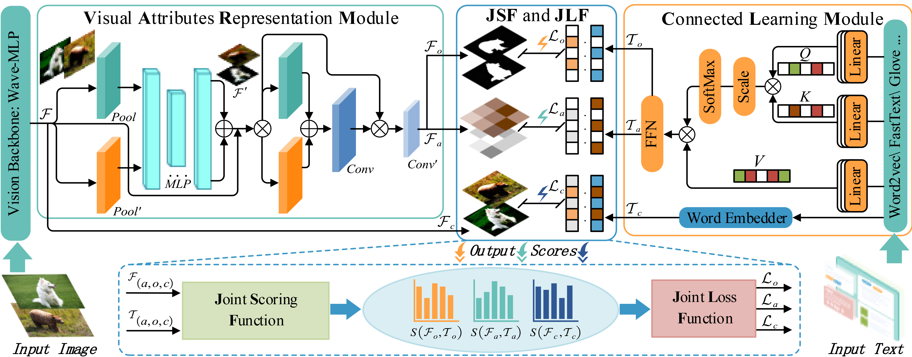

# LVAR-CZSL
**This is the official PyTorch code for the paper:  LVAR-CZSL:  Learning Visual Attributes Representation for Compositional Zero-Shot Learning.**

 **Xingjiang Ma**, **Jing Yang***,  **Jiacheng Lin**,  **Zhenzhe Zheng**,  **Shaobo Li**, **Bingqi Hu**, **Xiaoli Ruan**

**This is the overall architecture of the model:**

  

**The complete code will be uploaded after the paper is accepted.**

